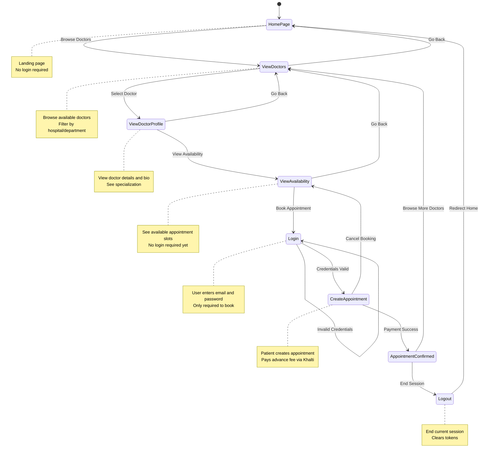

# Patient Flow State Diagram

## State Descriptions

| State | Description |
|-------|-------------|
| **HomePage** | Landing page - users can start browsing without login |
| **ViewDoctors** | Browse and filter available doctors by hospital/department |
| **ViewDoctorProfile** | View detailed doctor information, specialization, and bio |
| **ViewAvailability** | See available appointment time slots (no login required) |
| **Login** | User enters credentials only when they want to book an appointment |
| **CreateAppointment** | Book appointment and process Khalti payment |
| **AppointmentConfirmed** | Appointment successfully created and payment confirmed |
| **Logout** | End user session and redirect to home page |
